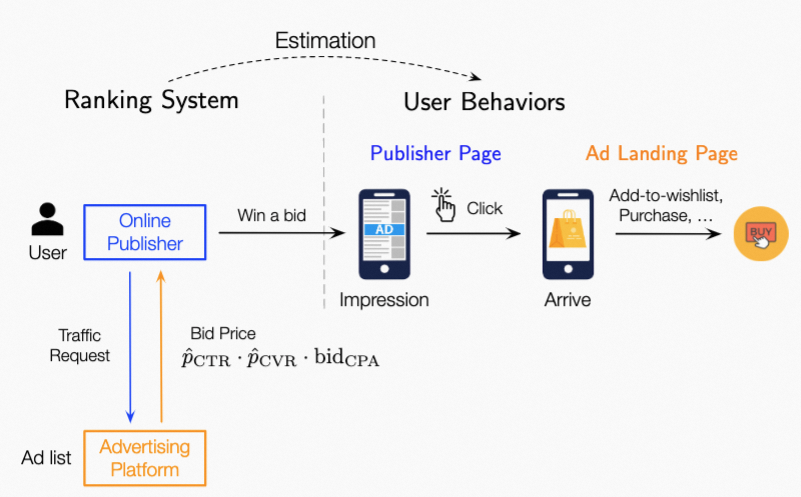

# 数据集
| Dataset|
| :------: |
| sample_train_aligned.tar.gz|
| sample_train_nonaligned.tar.gz |
| sample_test |

我们将数据集开源至天池，请通过 [链接](https://tianchi.aliyun.com/dataset/148347?spm=5176.12282013.0.0.1eed2f61qy5fB5) 进行下载。
## 1.数据描述
本数据集基于阿里电商点击数据集进行采集，其中包含广告展现平台和电商平台两个角色。如下图所示，广告平台通过实时竞价系统决定广告是否展现，其中CVR预估是竞价过程中关键因子，衡量了用户转化价值。如果竞价成功广告则展现给用户，同时用户点击了广告，用户则进入电商平台，进行一系列收藏加购成交等后链路行为。

数据可描述为$\{(x_{i} \rightarrow z_{i})\}|^{N}_{i=1}$，其中N是样本总量，$x_i$ 代表样本的特征向量，通常是被划分为多个域的高维稀疏向量，包含用户域、商品域等。z为二值标签（0 or 1），其中z=1代表样本发生转化事件，由于业务归因分析的需要，转化事件被定义为由本次点击引导的转化事件。

## 2.样本构建
本数据集由两部分组成：第一部分为训练数据（sample_train.tar.gz),第二部分为测试数据（sample_test.tar.gz)。

### 2.1样本主表
每条样本标记用户对商品的行为，样本主表包含样本ID、主/辅表关联所用外键、样本原始场景特征、标签等信息。

- 样本ID：唯一标识样本中一条记录的键值，样本ID经过hash处理。

- 外键：主/辅表关联所用外键，用于关联样本主表和用户域、商品域。

- 样本原始场景特征：包括样本发生时间、业务场景类型，业务场景侧交叉特征等。

- 标签部分：标签部分表示转化事件是否发生，1表示发生转化行为，0表示未发生转化。

### 2.2样本特征域
<table>
	<tr>
		<td>特征域名称</td>
		<td>特征域ID</td>
		<td>哪方特征</td>
		<td>特征域说明</td>
	</tr>
	<tr>
		<td rowspan="10">商品域</td>
		<td>l_i_fea_1</td>
		<td>标签方</td>
		<td rowspan="3">商品基础特征</td>
	</tr>
	<tr>
		<td>l_i_fea_2</td>
		<td>标签方</td>
	</tr>
	<tr>
		<td>l_i_fea_3</td>
		<td>标签方</td>
	</tr>
	<tr>
		<td>l_i_fea_4</td>
		<td>标签方</td>
		<td rowspan="3">店铺特征</td>
	</tr>
	<tr>
		<td>l_i_fea_5</td>
		<td>标签方</td>
	</tr>
	<tr>
		<td>l_i_fea_6</td>
		<td>标签方</td>
	</tr>
	<tr>
		<td>l_i_fea_7</td>
		<td>标签方</td>
		<td rowspan="4">商品流行度特征</td>
	</tr>
	<tr>
		<td>l_i_fea_8</td>
		<td>标签方</td>
	</tr>
	<tr>
		<td>l_i_fea_9</td>
		<td>标签方</td>
	</tr>
	<tr>
		<td>l_i_fea_10</td>
		<td>标签方</td>
	</tr>
	<tr>
		<td rowspan="10">用户域</td>
		<td>l_u_fea_1</td>
		<td>标签方/非标签方</td>
		<td rowspan="4">用户基础特征</td>
	</tr>
	<tr>
		<td>l_u_fea_2</td>
		<td>标签方</td>
	</tr>
	<tr>
		<td>l_u_fea_3</td>
		<td>标签方</td>
	</tr>
	<tr>
		<td>l_u_fea_4</td>
		<td>标签方</td>
	</tr>
	<tr>
		<td>l_u_fea_5</td>
		<td>标签方</td>
		<td rowspan="2">用户行为特征</td>
	</tr>
	<tr>
		<td>l_u_fea_6</td>
		<td>标签方</td>
	</tr>
	<tr>
		<td>f_u_fea_1</td>
		<td>非标签方</td>
		<td rowspan="4">用户媒体特征</td>
	</tr>
	<tr>
		<td>f_u_fea_2</td>
		<td>非标签方</td>
	</tr>
	<tr>
		<td>f_uc_fea_1</td>
		<td>非标签方</td>
	</tr>
	<tr>
		<td>f_uc_fea_2</td>
		<td>非标签方</td>
	</tr>
	<tr>
		<td rowspan="2">场景域</td>
		<td>l_c_fea</td>
		<td>非标签方</td>
		<td rowspan="3">流量侧特征</td>
	</tr>
	<tr>
		<td>f_c</td>
		<td>非标签方</td>
	</tr>

</table>
### 2.3样本关联
为了便于数据集使用，我们完成了样本拼接过程，用户可直接进行训练&预测。对于对齐部分的训练样本和测试样本，样本包含全部特征。对于非对齐的训练样本，特征只包含label party侧的数据。
    
## 3.引用说明
在任何形式的出版物中声明使用本数据，应包含如下论文的引用信息：

> ***.

## 4.协议
该数据集遵循协议：[CC BY-NC-SA 4.0](https://creativecommons.org/licenses/by-nc-sa/4.0/?spm=5176.12282016.0.0.313e492c7xmVCT).
