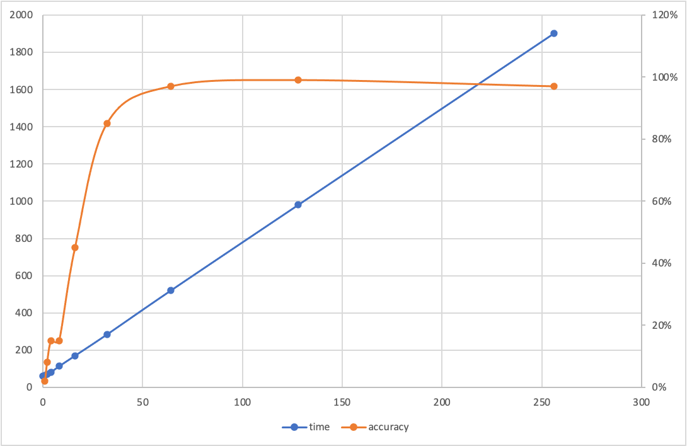

差分隐私算法主要参考论文：_**Deep Learning with Differential Privacy**_ ([https://arxiv.org/abs/1607.00133](https://arxiv.org/abs/1607.00133))<br />
差分隐私数学原理主要参考书籍：**《The Algorithm Foundations of Differential Privacy》**<br />
训练框架中的差分隐私模块以 tensorflow-privacy ([https://github.com/tensorflow/privacy](https://github.com/tensorflow/privacy))为基础，针对该框架中的训练模块做了适配。tensorflow-privacy 使用雷尼差分隐私衡量隐私保护效果，论文详见：<br />
_**Renyi Differential Privacy**_([https://arxiv.org/abs/1702.07476](https://arxiv.org/abs/1702.07476))<br />
_**The Discrete Gaussian for Differential Privacy**_([https://arxiv.org/abs/2004.00010](https://arxiv.org/abs/2004.00010))<br />
在差分隐私中，样本被称为records，mini-batch被称为samples，梯度被称为queries，具体请阅读论文：<br />
**_A General Approach to Adding Differential Privacy to Iterative Training Procedures_**
([https://arxiv.org/pdf/1812.06210.pdf](https://arxiv.org/pdf/1812.06210.pdf))
# 差分隐私算法简介
目前框架只提供了采用高斯噪声的差分隐私机制，因此以下算法以高斯噪声为例。

| **差分隐私随机梯度下降算法** |
| --- |
| **输入：** 训练样本，micro-batch大小L，mini-batch大小M，学习率，训练步数T<br />         高斯噪声标准差因子，梯度剪切阈值C，损失函数)​ |
| **输出：** 模型参数​ |
**算法流程：**<br />
1. 初始化模型参数为<br />
2. <br />
   1. 随机抽取M个样本，称为一个mini-batch<br />
   2. 将一个mini-batch分成若干个micro-batch，每个micro-batch包含L个样本<br />
   3. 计算每个micro-batch的梯度=\\nabla_{\\pmb\\theta_t}\\mathcal&space;L(\\pmb\\theta_t,X_i))<br />
   4. 梯度剪切=%5Cpmb%20g_t(X_i)/%5Cmax(1,%5Cfrac%7B%5C%7Cg_t(X_i)%5C%7C_2%7DC))<br />
   5. 梯度加噪=\\bar{\\pmb&space;g}_t(X_i)&plus;\\mathcal&space;N(0,&space;\sigma^2C^2))<br />
   6. 梯度求均值)<br />
   7. 更新模型参数<br />

<a name="nM3HG"></a>
# 差分隐私优化器
我们为用户提供了optimizer的装饰器，装饰器用于将非差分隐私optimizer转换为差分隐私的optimizer，并提供了一些已经装饰好的优化器：<br />
`DPAdagradOptimizer`、`DPAdamOptimizer`、`DPGradientDescentOptimizer`、<br />
`DPAdagradGaussianOptimizer`、`DPAdamGaussianOptimizer`、<br />
`DPGradientDescentGaussianOptimizer`<br />
这些优化器通过两个装饰器生成：`DPOptimizerClass`与`DPGaussianOptimizerClass`。
## DPOptimizerClass
```python
efl.make_optimizer_class(
    cls
)
```
调用该接口将会把一个非差分隐私的optimizer转换为差分隐私的optimizer，`cls`为希望转换的`tf.train.Optimizer`。该接口使用`DPOptimizerClass`装饰原生的optimizer。
```python
DPOptimizerClass(
    dp_sum_query,
    num_microbatches=None,
    unroll_microbatches=False,
    *args,
    **kwargs
)
```
### 参数
| **​参数列表** |  |  |
| --- | --- | --- |
| **dp_sum_query** | `DPQuery` | 实现梯度加噪并衡量隐私保护效果的类成员。 |
| **num_microbatches** | `int` | 差分隐私算法中micro-batch的数量。 |
| **unroll_microbatches** | `bool` | 该参数为`True`时内部的循环代码使用原生的for，否则使用`tf.while_loop`。默认为`False`，当`tf.while_loop`抛异常时可以考虑将该参数改为`True`。 |

`DPOptimizerClass`是装饰器的基类，差分隐私机制不同，**dp_sum_query**也不同，不同的子类装饰器传入了不同的**dp_sum_query**。当然，用户也可以通过该接口自定义**dp_sum_query**来实现不同的差分隐私机制。关于**dp_sum_query**的详情请参考tensorflow-privacy的源码：
[https://github.com/tensorflow/privacy/tree/master/tensorflow_privacy/privacy/dp_query](https://github.com/tensorflow/privacy/tree/master/tensorflow_privacy/privacy/dp_query)。
在当前框架中我们只提供了高斯机制的差分隐私，对应的装饰器为`DPGaussianOptimizerClass`。
### 方法
#### compute_gradients
```python
compute_gradients(
    loss,
    var_list,
    gate_gradients=GATE_OP,
    aggregation_method=None,
    colocate_gradients_with_ops=False,
    grad_loss=None,
    gradient_tape=None,
    opt_config=_DEFAULT_OPT_CONFIG
)
```
各参数含义与tf原生optimizer含义一致。与原生optimizer相比多了两个参数`gradient_tape`与`opt_config`，`gradient_tape`用于控制Eager模式与Graph模式，但当前框架只支持Graph模式，因此该参数无需关心。
`opt_config`从`Model.compile`接口中传入，用于控制optimizer的行为，详情可见：[efl.Model.compile](model_api.md)。
注意：与普通的随机梯度下降算法相比，差分隐私将batch又拆分成了一个个小batch，对每个小batch求loss，因此这就需要我们在传入loss的时候，需要传入每个样本的loss，而不是传入所有样本loss的均值。optimizer内部会自行将这些样本分组并计算loss均值。
## DPGaussianOptimizerClass
```python
efl.make_gaussian_optimizer_class(
   cls
)
```
调用该接口将会把一个非差分隐私的optimizer转换为使用了高斯机制的差分隐私optimizer，`cls`为希望转换的`tf.train.Optimizer`。该接口使用`DPGaussianOptimizerClass`装饰原生的optimizer。
```python
DPGaussianOptimizerClass(
    l2_norm_clip,
    noise_multiplier,
    num_microbatches=None,
    ledger=None,
    unroll_microbatches=False,
    *args,
    **kwargs
)
```
### 参数
| **​参数列表** |  |  |
| --- | --- | --- |
| **l2_norm_clip** | `float` | 差分隐私算法中的梯度剪切阈值。 |
| **noise_multiplier** | `float` | 差分隐私算法中的高斯噪声标准差因子。 |
| **num_microbatches** | `int` | 差分隐私算法中micro-batch的数量。 |
| **ledger** | `PrivacyLedger` | 用于记录隐私保护效果。 |
| **unroll_microbatches** | `bool` | 该参数为`True`时内部的循环代码使用原生的for，否则使用`tf.while_loop`。默认为`False`，当`tf.while_loop`抛异常时可以考虑将该参数改为`True`。 |

`DPGaussianOptimizerClass`继承自`DPOptimizerClass`，它根据参数**l2_norm_clip**和**noise_multiplier**构造了一个用于高斯机制的**dp_sum_query**，并传入了`DPOptimizerClass`的构造函数中，无需用户自行定义。
**ledger**是用于在训练时记录隐私保护效果的类成员，由于雷尼差分隐私可以在训练前就计算出隐私保护效果，所以该参数一般情况下并不需要使用，因此在新版的tensorflow-privacy中该参数及有关的类已被移除，但由于我们的框架为了兼容tf1.15，采用的并不是最新版的tensorflow-privacy。
# 差分隐私训练
本节介绍差分隐私机制如何配合联邦学习训练框架进行训练。
​

我们的训练框架支持多样化的训练方式：

- follower只提供tensor，但不需要返回梯度。比如模型的测试阶段。
- follower发送tensor，也需要梯度。比如模型的训练阶段。
- follower除了接收到对方的梯度外，自己还计算了梯度。这种情况一般代表双方有不同的下游模型。
- follower将模型直接发送给了对方。如follower向leader发送了预训练模型BERT的参数。

以上四种情况可以整合为如下机制：
**follower**: 将自身计算的梯度（若存在）与接收到的梯度相加，更新模型。
**leader**:除计算自身模型的梯度外，还要计算接收到的且follower希望回传的参数梯度。
且根据差分隐私的数学原理，若follower发送的是模型参数，leader需要对回传梯度加噪，若follower发送的是模型某一层的输出，则leader无需对回传梯度加噪。
以上就是框架中的训练逻辑。
# 差分隐私超参数测试
测试代码：`python/efl/example/dp_mnist/mnist_dp_cnn.py`<br />我们用MNIST数据集训练CNN作为测试，网络结构如下：

| Conv2D<br />(滤波器数量:16, 卷积核大小:8x8, 步长:2, 激活函数:ReLU, 填充策略:same) |
| --- |
| MaxPooling2D<br />(池化窗口大小:2x2, 步长:1) |
| Conv2D<br />(滤波器数量:32, 卷积核大小:4x4, 步长:2, 激活函数:ReLU, 填充策略:valid) |
| MaxPooling2D<br />(池化窗口大小:2x2, 步长:1) |
| Flatten |
| Dense<br />(神经元个数:32, 激活函数:ReLU) |
| Dense<br />(神经元个数:10) |

**loss**: softmax交叉熵（`tf.nn.sparse_softmax_cross_entropy_with_logits`）
<a name="bq8G9"></a>
## 效果测试
**clip**: 梯度剪切的阈值，)<br />**stddev_ratio**: 高斯噪声标准差的因子，<br />**microbatch**: 一个batch被差分隐私框架切分成若干个microbatch，microbatch的数量必须能整除batch_size，<br />每个microbatch单独训练，所有microbatch的梯度聚合加噪。<br />**eposilon**: 差分隐私的衡量指标，越小隐私保护程度越高<br />**delta:** 差分隐私的衡量指标，越小隐私保护程度越高
<a name="kugp4"></a>
#### 1. stddev_ratio对效果的影响
| 学习率 | stddev_ratio | clip | batch大小 | microbatch数量 | epoch数量 | epsilon | 准确率 | delta |
| --- | --- | --- | --- | --- | --- | --- | --- | --- |
| 0.25 | - | - | 256 | - | 20 | 无保护 | 100% | - |
| 0.25 | 1.3 | 1.5 | 256 | 256 | 20 | 1.11 | 97% | 1e-5 |
| 0.25 | 0.7 | 1.5 | 256 | 256 | 20 | 4.55 | 98% | 1e-5 |
| 0.25 | 0.5 | 1.5 | 256 | 256 | 20 | 14.4 | 99% | 1e-5 |

结论：噪声的降低会提高准确率但会损失隐私保护效果。
#### 2. clip对效果的影响
| 学习率 | stddev_ratio | clip | batch大小 | microbatch数量 | epoch数量 | epsilon | 准确率 | delta |
| --- | --- | --- | --- | --- | --- | --- | --- | --- |
| 0.25 | - | - | 256 | - | 20 | 无保护 | 100% | - |
| 0.25 | 1.0 | 10 | 256 | 256 | 20 | 1.77 | 88% | 1e-5 |
| 0.25 | 1.0 | 2 | 256 | 256 | 20 | 1.77 | 99% | 1e-5 |
| 0.25 | 1.0 | 1.5 | 256 | 256 | 20 | 1.77 | 99% | 1e-5 |
| 0.25 | 1.0 | 1.0 | 256 | 256 | 20 | 1.77 | 97% | 1e-5 |
| 0.25 | 1.0 | 0.1 | 256 | 256 | 20 | 1.77 | 87% | 1e-5 |

结论：clip的改变并不会影响隐私保护的效果，对于不同的模型，梯度2范数的大小不同，clip的选取应该因地制宜，适模型的情况而定。例如在当前的MNIST数据集与CNN下，当clip=0.1时，虽然最终的准确率只有87%，但每个epoch的准确率都在稳步增加；当clip=10时，每个epoch的准确率波动较大，呈螺旋式上升。因此我们要根据当前模型的情况，合理选取clip区间，过大会导致梯度在error surface上跳跃，难以降到最低点；过小会导致下降缓慢，需要训练较长的时间，也可能落入局部极点。clip在一定程度上可以看作另一个学习率。
## 性能测试
#### 1. 初步测试（microbatch数量对模型的影响）
在stddev_ratio=1.0, clip=1.0, batch_size=256, epoch=20, learning_rate=0.25的参数设置下，调整microbatch的数量，利用MNIST数据集训练CNN：

| microbatch数量 | 0（不使用差分隐私） | 1 | 2 | 4 | 8 | 16 | 32 | 64 | 128 | 256 |
| --- | --- | --- | --- | --- | --- | --- | --- | --- | --- | --- |
| 执行时间（秒） | 59 | 63 | 69 | 82 | 113 | 170 | 284 | 520 | 981 | 1901 |
| 准确率 | 100% | 2% | 8% | 15% | 15% | 45% | 85% | 97% | 99% | 97% |

<div align=center>
    
</div>

结论：差分隐私中影响性能的超参数为microbatch的数量。根据测试结果可知，microbatch的数量与训练时间呈正线性关系，与准确率呈正相关。这是因为训练步数=microbatch数量*minibatch数量，因此microbatch与训练时间成正比，而minibatch是差分隐私框架的更新单元，microbatch是加噪单元，一个minibatch中microbatch数量越多，噪声之间就越容易“中和”，梯度越不容易偏离正确方向，因此准确率与microbatch的数量成正相关。
