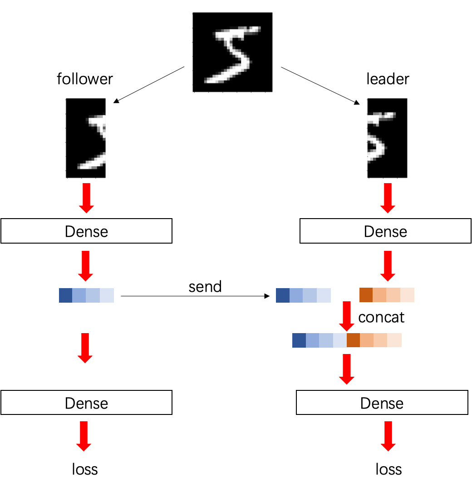
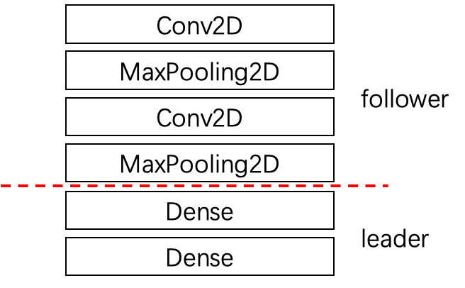
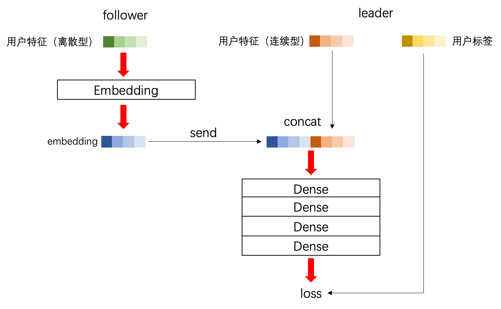

`python/efl/example`文件夹中包含了若干样例程序。样例程序大致分为两类，一类是单机样例，用于介绍如何在单机上跑联邦学习任务；另一类是联邦样例，用于展示如何在不同的参与方之间运行联邦学习任务。我们的训练框架将联邦学习双方分别称为follower和leader，联邦样例的文件名标识了其属于哪一方。
​

一个模型的编写需要至少完成以下几个部分的定义

- input_fn：定义数据读取方式和生成embedding的方式（定义tensorflow的feature column）
- loss_fn：定义整个训练模型以及损失函数
- optimizer_fn：定义模型的优化器
- procedure_fn：定义模型训练流程

​

以下是该文件夹中所有的文件及其内容：

- `train.py`: 单机下进行training任务的简单样例
- `train_and_eval.py`: 单机下进行training及testing任务的简单样例
- `mnist`: 该文件夹中包含了一个MNIST数据集的联邦样例
- `dp_mnist`: 该文件夹中包含了使用差分隐私训练MNIST数据集的联邦样例和单机样例
- `entropy_mnist`: 该文件夹中包含了一个使用前向加密技术训练MNIST数据集的联邦样例
- `criteo`: 该文件夹中包含了一个criteo数据集的联邦样例

# 单机示例
在`train.py`和`train_and_eval.py`中你将会看到使用训练框架的基本步骤：

1. 实例化Model类
1. 设置input_fn，loss_fn，eval_fn，optimizer_fn
1. 调用compile编译计算图
1. 调用fit开启训练

以`train_and_eval.py`的代码为例：

```python
CNN = efl.Model() # 实例化Model
CNN.input_fn(input_fn) # 设置input_fn
CNN.loss_fn(loss_fn) # 设置loss_fn
CNN.eval_fn(eval_fn) # 设置eval_fn
CNN.optimizer_fn(
    efl.optimizer_fn.optimizer_setter(
        tf.train.GradientDescentOptimizer(0.01))) # 设置optimizer
CNN.compile() # 编译
CNN.fit(efl.procedure_fn.train_and_evaluate(train_step=100, # 每epoch训练100步
                                            eval_step=10, # 每epoch测试100步
                                            max_iter=5), # epoch数
        log_step=10, # 每10个step打印一次日志
        project_name="train_and_eval") # 项目名
```

下面介绍input_fn的写法：

```python
def input_fn(model, mode):
  # 定义columns
  columns = {
    "deep": [tf.feature_column.numeric_column('dense', 2)], # dense特征
    "label": [tf.feature_column.numeric_column('label', 1)], # label特征
    "emb": [ # embedding特征
        tf.feature_column.embedding_column(
            tf.feature_column.categorical_column_with_identity("sparse1", 1000),
            dimension=8),
        tf.feature_column.embedding_column(
            tf.feature_column.categorical_column_with_identity("sparse2", 1000),
            dimension=8)]}
  if mode == efl.MODE.TRAIN:
    # 训练阶段的feature
    features = {
      "dense": tf.constant([[1,2]], dtype=tf.float32),
      "label": tf.constant([[1.0]], dtype=tf.float32),
      "sparse1": tf.SparseTensor(indices=[[0,0], [0,2]],
                                 values=[1,2], dense_shape=[1,4]),
      "sparse2": tf.SparseTensor(indices=[[0,1], [0,2]],
                                 values=[3,4], dense_shape=[1,4])}
  else:
    # 测试阶段的feature
    features = {
      "dense": tf.constant([[1,2]], dtype=tf.float32),
      "label": tf.constant([[1.0]], dtype=tf.float32),
      "sparse1": tf.SparseTensor(indices=[[0,0], [0,2]],
                                 values=[1,2], dense_shape=[1,4]),
      "sparse2": tf.SparseTensor(indices=[[0,1], [0,2]],
                                 values=[3,4], dense_shape=[1,4])}
  with tf.variable_scope("input_fn", reuse=tf.AUTO_REUSE):
    return efl.Sample(features, columns);
```

1. 首先你要定义一个columns字典，字典中每个元素都是一个特征列，key是列的名字，value是该列对应的feature_column列表。代码中展示了dense、label、embedding三类特征列的定义方式。
1. 然后你需要定义features字典，如果你需要将数据分成测试集和训练集，那么就要定义两个features。features的key是每个feature的名字，value是数据。在本样例中数据是固定不变的。
1. 最后你要返回一个`efl.Sample`，它由前两步定义的columns与features生成。

注意：features的key要与columns中定义的`tf.feature_column`的key对应。
`efl.Sample`的具体使用方式可见：[efl.Sample](data_api.md)。
​

下面介绍loss_fn和eval_fn的写法：

```python
def model_fn(model, sample, is_training):
  # 定义模型
  inputs = tf.concat([sample['deep'], sample['emb']], axis=1) # 获取输入
  fc1 = tf.layers.dense(inputs, 128)
  fc2 = tf.layers.dense(fc1, 64)
  fc3 = tf.layers.dense(fc2, 32)
  y = tf.layers.dense(fc3, 1)

  if is_training: # 训练阶段 返回loss
    loss = tf.losses.sigmoid_cross_entropy(sample['label'], y)
    return loss
  else: # 测试阶段 返回auc值
    prediction = tf.nn.sigmoid(y)
    auc = efl.metrics.auc(sample['label'], prediction)
    model.add_metric("auc", auc, efl.MODE.EVAL)
    return auc

def loss_fn(model, sample):
  with tf.variable_scope('deepctr'):
    return model_fn(model, sample, True)

def eval_fn(model, sample):
  with tf.variable_scope('deepctr', reuse=tf.AUTO_REUSE):
    return model_fn(model, sample, False)
```

我们一般会将模型结构定义在model_fn中，然后根据训练阶段和测试阶段的不同需求返回不同的op，在model_fn中可以通过参数sample拿到在input_fn中定义的column。
# 联邦示例
在`mnist`文件夹中我们编写了如下的一个模型：
<div align=center>
    
</div>
双方各持有一半的特征，分别通过一层dense，follower将dense的输出发送给leader，leader将双方dense的输出拼接起来，然后双方继续训练。
​

`leader.py`中是leader的代码，`follower.py`中是follower的代码。
首先生成数据：
```shell
python generate_data.py
```
然后在单机上模拟联邦学习（两个终端上分别执行）：
```shell
python leader.py --federal_role=leader
```
```shell
python follower.py --federal_role=follower
```
联邦代码与单机代码不同的地方有三处：

1. 应该实例化FederalModel而不是Model
```python
CTR = efl.FederalModel() # 实例化FederalModel
CTR.input_fn(input_fn)
CTR.loss_fn(model_fn)
CTR.optimizer_fn(
    efl.optimizer_fn.optimizer_setter(
        tf.train.GradientDescentOptimizer(0.001)))
CTR.compile()
CTR.fit(efl.procedure_fn.train(),
        log_step=1,
        project_name="train")
```

2. input_fn返回的是FederalSample而不是Sample
```python
def input_fn(model, mode):
  if mode == efl.MODE.TRAIN:
    dataio = efl.data.FederalDataIO("./follower_train", 256,
                                    model.communicator,
                                    model.federal_role,
                                    0, 1, data_mode='local')
    dataio.fixedlen_feature('sample_id', 1, dtype=tf.int64)
    dataio.fixedlen_feature('feature', 14*28, dtype=tf.float32)
    dataio.fixedlen_feature('label', 1, dtype=tf.float32)
    features = dataio.read() # features由dataio生成
    model.add_hooks([dataio.get_hook()]) # 添加FederalDataIOHook
    columns = {
      "label": [tf.feature_column.numeric_column('label', 1)],
      "emb": [tf.feature_column.numeric_column('feature', 28*14)]}
    return efl.FederalSample(features, columns, model.federal_role,
                             model.communicator,
                             sample_id_name='sample_id') # 声明sample_id
```
这段代码中也展示了如何使用`FederalDataIO`构造`FederalSample`。`DataIO`会从指定目录下读取所有TFRecord文件。用户通过调用`dataio.read`可以获取features。`dataio.fixedlen_feature`用于指定一个定长特征，`FederalDataIO`初始化中各参数的意义请见：[efl.FederalDataIO](data_api.md)。
注意：与单机模式不同，联邦模式在生成数据时必须要有一项特征作为sample_id，你需要在FederalSample初始化时显示地声明哪一项特征是sample_id，将该特征的name传给构造器。sample_id用于唯一标识双方共有的一条样本，双方分别持有该样本的不同特征。因此训练时必须保证sample_id时刻一致。

3. 模型定义中存在send和recv

```python
#follower
def model_fn(model, sample):
  input = sample['emb']
  label = tf.cast(sample['label'], tf.int32)
  label = tf.reshape(label, [-1])
  label = tf.one_hot(label, 10)

  fc1 = tf.layers.dense(input, 128,
    kernel_initializer=tf.truncated_normal_initializer(
      stddev=0.001, dtype=tf.float32))
  model.send('fc1', fc1, True) # 发送第一层dense的输出
  y = tf.layers.dense(
    fc1, 10, kernel_initializer=tf.truncated_normal_initializer(
      stddev=0.001, dtype=tf.float32))

  pred = tf.argmax(y, axis=-1)
  _, accuracy = tf.metrics.accuracy(sample['label'], pred)
  model.add_metric('accuracy', accuracy)

  loss = tf.losses.softmax_cross_entropy(label, y)
  return loss
```

```python
#leader
def model_fn(model, sample):
  input = sample['emb']
  label = tf.cast(sample['label'], tf.int32)
  label = tf.reshape(label, [-1])
  label = tf.one_hot(label, 10)

  fc1 = tf.layers.dense(input, 128,
    kernel_initializer=tf.truncated_normal_initializer(
      stddev=0.001, dtype=tf.float32))
  f_fc1 = model.recv('fc1', dtype=tf.float32, require_grad=True) # 接收数据
  f_fc1 = tf.reshape(f_fc1, [-1, 128])
  fc1 = tf.concat([fc1, f_fc1], axis=-1) # 拼接双方数据
  y = tf.layers.dense(
    fc1, 10, kernel_initializer=tf.truncated_normal_initializer(
      stddev=0.001, dtype=tf.float32))

  pred = tf.argmax(y, axis=-1)
  _, accuracy = tf.metrics.accuracy(sample['label'], pred)
  model.add_metric('accuracy', accuracy)

  loss = tf.losses.softmax_cross_entropy(label, y)
  return loss
```

发送与接收数据时要指定该数据是否参与梯度的计算，若`require_grad=True`，则反向时框架会自行计算梯度并将梯度回传给发送方。
注意：当你在代码中接收数据时，一定要reshape接收到的数据，改成你期望的形状。因为接收到的tensor的shape默认是unknown。
# 差分隐私示例
差分隐私简单来说就是对梯度加入噪声，从而干扰模型的更新，达到混淆模型输出的目的，具体解释详见：[差分隐私](differential_privacy.md)。
​

在`dp_mnist`文件夹中我们编写一个单机示例和一个联邦示例，我们首先来看单机示例：
​

差分隐私与非差分隐私的第一个区别就是，在差分隐私中我们需要将Optimizer换成对应的差分隐私Optimizer，该优化器将在计算梯度时对梯度加入噪声。
```python
CNN = efl.Model()
CNN.input_fn(input_fn)
CNN.loss_fn(loss_fn)
CNN.eval_fn(eval_fn)
CNN.optimizer_fn(
    efl.optimizer_fn.optimizer_setter(
        efl.DPGradientDescentGaussianOptimizer( # 使用差分隐私Optimizer
            l2_norm_clip=1.0, noise_multiplier=1.0, learning_rate=0.25)))
CNN.compile()
CNN.fit(efl.procedure_fn.train_and_evaluate(train_step=235,
                                            eval_step=100,
                                            max_iter=20),
        log_step=100,
        project_name="mnist")
```
第二个区别是在计算loss时需要返回一个`shape=[batch_size, ]`的loss，而不是一个`scalar`的loss。差分隐私在返回loss的阶段不需要取均值，因为差分隐私机制会根据你传入的`num_microbatches`参数对mini-batch进行切分，针对每一个micro-batch做reduce。

```python
def model_fn(model, sample, is_training):
  inputs = tf.reshape(sample['img'], [-1, 28, 28, 1])
  labels = tf.squeeze(tf.cast(sample['label'], tf.int32))
  y = tf.layers.conv2d(inputs, 16, 8, strides=2,
                       padding='same', activation='relu')
  y = tf.layers.max_pooling2d(y, 2, 1)
  y = tf.layers.conv2d(y, 32, 4, strides=2,
                       padding='valid', activation='relu')
  y = tf.layers.max_pooling2d(y, 2, 1)
  y = tf.layers.flatten(y)
  y = tf.layers.dense(y, 32, activation='relu')
  logits = tf.layers.dense(y, 10)
  
  if is_training:
    # 计算reduce前的loss
    loss = tf.nn.sparse_softmax_cross_entropy_with_logits(labels=labels,
                                                          logits=logits)
    return loss
  else:
    prediction = tf.argmax(logits, axis=-1)
    accuracy = tf.metrics.accuracy(labels, prediction)
    model.add_metric('accuracy', accuracy, efl.MODE.EVAL)
    return accuracy[1]
```

前面提到在对梯度加噪时差分隐私机制会自行对loss做reduce操作。你可以通过compile的opt_config定义reduce的行为，默认使用`tf.reduce_mean`，你可以更改为`tf.reduce_sum`等，如下：

```shell
CNN.compile(opt_config={'REDUCE': 'sum'})
```

另外该代码还展示了如何用`tf.Dataset`构造input_fn：在生成Dataset后创建Dataset的迭代器，然后在input_fn中使用迭代器获取数据即可。

```python
# 获取MNIST数据集
train, test = tf.keras.datasets.mnist.load_data()
train_data, train_labels = train
test_data, test_labels = test
# 数据归一化
train_data = np.array(train_data, dtype=np.float32) / 255.0
test_data = np.array(test_data, dtype=np.float32) / 255.0

train_labels = np.array(train_labels, dtype=np.int32)
test_labels = np.array(test_labels, dtype=np.int32)
# 生成Dataset
train_dataset = tf.data.Dataset.from_tensor_slices((train_data, train_labels))
train_dataset = train_dataset.shuffle(1000).batch(256).repeat()
train_iterator = train_dataset.make_one_shot_iterator() # 创建迭代器

test_dataset = tf.data.Dataset.from_tensor_slices((test_data, test_labels))
test_dataset = test_dataset.batch(100).repeat()
test_iterator = test_dataset.make_one_shot_iterator()

def input_fn(model, mode):
  # 利用Dataset的迭代器获取每次训练的数据
  if mode == efl.MODE.TRAIN:
    batch = train_iterator.get_next()
  else:
    batch = test_iterator.get_next()

  columns = {
      "img": [tf.feature_column.numeric_column('img', 28*28)],
      "label": [tf.feature_column.numeric_column('label', 1, dtype=tf.int32)]}
  features = {
      "img": batch[0],
      "label": batch[1]}
  with tf.variable_scope("input_fn", reuse=tf.AUTO_REUSE):
    return efl.Sample(features, columns)
```
下面我们来看联邦示例，在该联邦示例中，我们将模型切分成了两部分，分别交给follower和leader：
<div align=center>
    
</div>

```python
#follower
def model_fn(model, sample, is_training):
  inputs = tf.reshape(sample['img'], [-1, 28, 28, 1])
  labels = tf.squeeze(tf.cast(sample['label'], tf.int32))
  y = tf.layers.conv2d(inputs, 16, 8, strides=2,
                       padding='same', activation='relu')
  y = tf.layers.max_pooling2d(y, 2, 1)
  y = tf.layers.conv2d(y, 32, 4, strides=2,
                       padding='valid', activation='relu')
  y = tf.layers.max_pooling2d(y, 2, 1)
  y = tf.layers.flatten(y)
  # 发送数据
  if is_training: # 训练阶段需要返回梯度
    model.send('y_train', y, require_grad=True)
    model.send('labels_train', labels, require_grad=False)
  else: # 测试阶段不需要返回梯度
    model.send('y_test', y, mode=efl.MODE.EVAL, require_grad=False)
    model.send('labels_test', labels,
               mode=efl.MODE.EVAL, require_grad=False)
  return y
```

```python
#leader
def model_fn(model, sample, is_training):
  # 接收follower侧的输出
  if is_training:
    labels = model.recv('labels_train', dtype=tf.int32, require_grad=False)
    y = model.recv('y_train', dtype=tf.float32, require_grad=True)
  else:
    labels = model.recv('labels_test', dtype=tf.int32, require_grad=False)
    y = model.recv('y_test', dtype=tf.float32, require_grad=False)
  # 通过两层dense
  y = tf.reshape(y, [-1, 512]) # reshape数据
  y = tf.layers.dense(y, 32, activation='relu')
  logits = tf.layers.dense(y, 10)

  if is_training: # 训练阶段返回loss
    # 计算loss，但不做reduce
    loss = tf.nn.sparse_softmax_cross_entropy_with_logits(labels=labels,
                                                          logits=logits)
    return loss
  else: # 测试阶段返回accuracy
    prediction = tf.argmax(logits, axis=-1)
    accuracy = tf.metrics.accuracy(labels, prediction)
    model.add_metric('accuracy', accuracy, efl.MODE.EVAL)
    return accuracy[1]
```

与单机模式不同的是，联邦模式下差分隐私在compile时用户可以通过opt_config指定backend的行为：
```python
CNN = efl.FederalModel()
CNN.input_fn(input_fn)
CNN.loss_fn(loss_fn)
CNN.eval_fn(eval_fn)
CNN.optimizer_fn(
    efl.optimizer_fn.optimizer_setter(
        efl.DPGradientDescentGaussianOptimizer(
            l2_norm_clip=1.0, noise_multiplier=1.0, learning_rate=0.25)))
# 指定backend_mode和reduce
CNN.compile(opt_config={'BACKEND_MODE': 'unnoise'})
CNN.fit(efl.procedure_fn.train_and_evaluate(train_step=235,
                                            eval_step=100,
                                            max_iter=20),
        log_step=100,
        project_name='fed_mnist')
```
`BACKEND_MODE`的作用是决定是否对回传给对方的梯度加入噪声。`unnoise`表示框架不会对回传的梯度加噪，但会对不需要回传的梯度加入噪声。
根据差分隐私的数学原理，当follower发送给leader的不是模型参数时，回传梯度时不能加入噪声，否则会使得follower侧继续计算梯度的过程中将噪声不断放大导致模型效果受损；当follower发送给leader的是模型参数时，回传的梯度可以加入噪声，以达到更好的隐私保护效果。
# 前向加密示例
EFLS框架提供了一个前向加密层，用于在对方无法拿到实际的数据情况下完成两侧embedding的concat操作。
在开始训练之前follower侧需要执行generate_paillier_keypair.py，为两侧生成同态加密的密钥，follower侧再将public_key.json同步给leader侧。

```python
#leader侧：在模型中创建并使用EncryptPassiveLayer
def model_fn(model, sample):
  input = sample['emb']
  fc1 = tf.layers.dense(input, 128,
    kernel_initializer=tf.truncated_normal_initializer(
      stddev=0.001, dtype=tf.float32))
  # 定义前向加密的EncryptPassiveLayer，己方提供128维的embedding，对方提供128维的embedding
  passive_layer = efl.privacy.EncryptPassiveLayer(
      model.communicator, 128, 128, "public_key.json")
  fc1 = passive_layer(fc1)
  fc1 = tf.reshape(fc1, [-1, 256])
  y = tf.layers.dense(
    fc1, 10, kernel_initializer=tf.truncated_normal_initializer(
      stddev=0.001, dtype=tf.float32))
  pred = tf.argmax(y, axis=-1)
  _, accuracy = tf.metrics.accuracy(sample['label'], pred)
  model.add_metric('accuracy', accuracy)
  label = tf.cast(sample['label'], tf.int32)
  label = tf.reshape(label, [-1])
  label = tf.one_hot(label, 10)
  loss = tf.losses.softmax_cross_entropy(label, y)
  return loss

```

```python
#follower侧：在模型中创建并使用EncryptActiveLayer
def model_fn(model, sample):
  input = sample['emb']
  fc1 = tf.layers.dense(input, 128,
    kernel_initializer=tf.truncated_normal_initializer(
      stddev=0.001, dtype=tf.float32))
  # 定义前向加密的EncryptActiveLayer，向对方提供128维的embedding，并且不随着训练的迭代变化噪声
  active_layer = efl.privacy.EncryptActiveLayer(
      model.communicator, 128, "public_key.json", "private_key.json", update_noise=False)
  fc1 = active_layer(fc1)
  y = tf.layers.dense(
    fc1, 10, kernel_initializer=tf.truncated_normal_initializer(
      stddev=0.001, dtype=tf.float32))
  pred = tf.argmax(y, axis=-1)
  _, accuracy = tf.metrics.accuracy(sample['label'], pred)
  model.add_metric('accuracy', accuracy)
  label = tf.cast(sample['label'], tf.int32)
  label = tf.reshape(label, [-1])
  label = tf.one_hot(label, 10)
  loss = tf.losses.softmax_cross_entropy(label, y)
  return loss
```

# CRITEO数据集示例
在`criteo`文件夹中我们实现了如下模型，简单将联邦学习训练框架与CTR预估结合：
<div align=center>
    
</div>

首先我们对数据进行预处理，去掉空值，将连续型数据z-score标准化。在经过数据预处理后，数据集中存在21列离散的数据，10列连续的数据和1列标签。
follower将这21列离散数据利用`tf.feature_column.embedding_column`处理为一个稠密tensor，并发送给leader。leader将10列连续的数据直接拼接成一个tensor，再将这个tensor与从follower接收来的tensor拼接，作为模型整体的输入。
代码部分与前文差别不大，重点是展示了`DataIO`如何处理不同类型的特征：

```python
#follower
def input_fn(model, mode):
  if mode == efl.MODE.TRAIN:
    dataio = efl.data.FederalDataIO("./follower_train", 1000,
                                    model.communicator,
                                    model.federal_role,
                                    0, 1, data_mode='local',
                                    num_epochs=10)
  else:
    dataio = efl.data.FederalDataIO("./follower_test", 1000,
                                    model.communicator,
                                    model.federal_role,
                                    0, 1, data_mode='local',
                                    num_epochs=10)

  dataio.fixedlen_feature('sample_id', 1, dtype=tf.int64)
  # embedding类型的数据
  for i in range(21): # 21列离散特征
    dataio.fixedlen_feature('feature' + str(i), 1, dtype=tf.string)
  features = dataio.read()
  model.add_hooks([dataio.get_hook()])
  columns = {
      'embedding': [
          tf.feature_column.embedding_column(
              tf.feature_column.categorical_column_with_hash_bucket(
                  'feature' + str(i), id_nums[i]),
              dimension=8, combiner='mean')
          for i in range(21)]}
  return efl.FederalSample(
      features, columns, model.federal_role,
      model.communicator, sample_id_name='sample_id',
      name='train' if mode == efl.MODE.TRAIN else 'eval')
```

```python
#leader
def input_fn(model, mode):
  if mode == efl.MODE.TRAIN:
    dataio = efl.data.FederalDataIO("./leader_train", 1000,
                                    model.communicator,
                                    model.federal_role,
                                    0, 1, data_mode='local',
                                    num_epochs=10)
  else:
    dataio = efl.data.FederalDataIO("./leader_test", 1000,
                                    model.communicator,
                                    model.federal_role,
                                    0, 1, data_mode='local',
                                    num_epochs=10)

  dataio.fixedlen_feature('sample_id', 1, dtype=tf.int64)
  # label数据
  dataio.fixedlen_feature('label', 1, dtype=tf.int64)
  # dense数据
  dataio.fixedlen_feature('dense', 10, dtype=tf.float32)
  features = dataio.read()
  model.add_hooks([dataio.get_hook()])
  columns = {
      'dense': [tf.feature_column.numeric_column('dense', 10)],
      'label': [tf.feature_column.numeric_column('label', 1)]}
  return efl.FederalSample(
      features, columns, model.federal_role,
      model.communicator, sample_id_name='sample_id',
      name = 'train' if mode == efl.MODE.TRAIN else 'eval')
```

代码运行：

1. 首先要获取criteo数据集：[https://www.kaggle.com/mrkmakr/criteo-dataset](https://www.kaggle.com/mrkmakr/criteo-dataset)，放在`criteo`文件夹下
1. 数据预处理：
```shell
python generate_data.py
```

3. 在单机上模拟联邦学习（两个终端上分别执行）：
```shell
python criteo_dp_follower_dense.py --federal_role=follower
```
```shell
python criteo_dp_leader_dense.py --federal_role=leader
```
